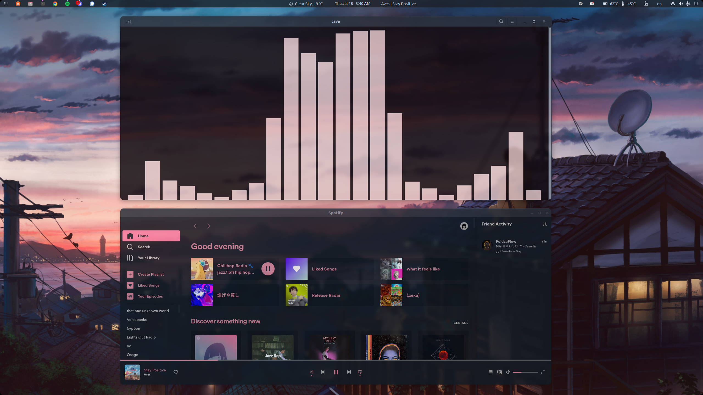

[](LICENSE)

# **StelveUbuntu**

### My customized Ubuntu GNOME experience



## **GNOME Extensions**
### **Built-in**
#### Enabled
* [Ubuntu AppIndicators](https://extensions.gnome.org/extension/1301/ubuntu-appindicators/)
#### Disabled
* [Applications Menu](https://extensions.gnome.org/extension/6/applications-menu/)
* [Auto Move Windows](https://extensions.gnome.org/extension/16/auto-move-windows/)
* [Desktop Icons NG (DING)](https://extensions.gnome.org/extension/2087/desktop-icons-ng-ding/)
* [Launch new instance](https://extensions.gnome.org/extension/600/launch-new-instance/)
* [Native Window Placement](https://extensions.gnome.org/extension/18/native-window-placement/)
* [Places Status Indicator](https://extensions.gnome.org/extension/8/places-status-indicator/)
* [Removable Drive Menu](https://extensions.gnome.org/extension/7/removable-drive-menu/)
* [Screenshot Window Sizer](https://extensions.gnome.org/extension/881/screenshot-window-sizer/)
* [Ubuntu Dock](https://extensions.gnome.org/extension/1300/ubuntu-dock/)
* [Window List](https://extensions.gnome.org/extension/602/window-list/)
* [windowNavigator](https://extensions.gnome.org/extension/10/windownavigator/)
* [Workspace Indicator](https://extensions.gnome.org/extension/21/workspace-indicator/)
### **Manually installed** *(see [extensions](gnome-extensions))*
* [Application Volume Mixer](https://extensions.gnome.org/extension/3499/application-volume-mixer/)
* [Applications Menu](https://extensions.gnome.org/extension/6/applications-menu/)
* [Auto Move Windows](https://extensions.gnome.org/extension/16/auto-move-windows/)
* [Clipboard Indicator](https://extensions.gnome.org/extension/779/clipboard-indicator/)
* [Dash to Panel](https://extensions.gnome.org/extension/1160/dash-to-panel/) *(see [config](configs/extensions/dash_to_panel.cfg))*
* [Freon](https://extensions.gnome.org/extension/841/freon/)
* [GameMode](https://extensions.gnome.org/extension/1852/gamemode/)
* [OpenWeather](https://extensions.gnome.org/extension/750/openweather/) *(position left)*
* [Panel corners](https://extensions.gnome.org/extension/4805/panel-corners/)
* [Sound Input & Output Device Chooser](https://extensions.gnome.org/extension/906/sound-output-device-chooser/)
* [spotify-tray](https://extensions.gnome.org/extension/4472/spotify-tray/) *(position center)*
* [Tweaks & Extensions in System Menu](https://extensions.gnome.org/extension/1653/tweaks-in-system-menu/)
* [User Themes](https://extensions.gnome.org/extension/19/user-themes/)

## **GNOME Tweaks**
### **Background**
* See [background image](images/background.png)
### **Mouse**
* **Acceleration Profile**: Flat
* **Middle Click Paste**: Disabled
### **Top Bar**
* **Weekday**: Enabled
* **Date**: Enabled
* **Seconds**: Disabled
* **Week Numbers**: Disabled

## **GTK Theme**
I use Nordic-darker-standard-buttons from [Nordic](https://github.com/EliverLara/Nordic) theme

## **Mutter**
I use [mutter-rounded](https://github.com/yilozt/mutter-rounded) with:
* **Rounded radius**: 15
* **Blur sigmal**: 5
* **Blur brightness**: 80
* **Blured window opacity**: 80
### **Blured List**
Use on whatever you want
#### Examples include
* software-properties-gtk
* gnome-extensions-app
* gnome-control-center
* gnome-tweaks
* spotify
* gnome-terminal-server
* mutter_setting
* org.gnome.Nautilus
#### Persist on system update
```
sudo apt-mark hold libmutter-10-0 mutter-common
```

## **Applications**
### **Terminal**
#### Theme variant
* **Dark**
#### Initial size
* **Columns**: 135
* **Rows**: 40
#### Colors
Generated from wallpaper by [pywal](https://github.com/dylanaraps/pywal)
```
wal -i "/path/to/img"
```
Persist on reboot
```
wal -R
```
### **Discord**
[BetterDiscord](https://betterdiscord.app/) with modified [Zelk](https://github.com/schnensch0/zelk) theme *(see [modified css](configs/betterdiscord/zelkBD.theme.css))*
### **Spotify**
[Spicetify](https://spicetify.app/) with [Sleek Cherry](https://github.com/spicetify/spicetify-themes/tree/master/Sleek) theme
### **VSCode**
Nord Aurora Darker from [Nord Palette](https://github.com/AvetisDN/nord-palette) theme
### **Steam**
Vanilla or [Metro](https://metroforsteam.com/) theme

## **System Configuration**
I add ``__GL_SYNC_DISPLAY_DEVICE=YOUR_MONITOR`` to my ``/etc/environment`` in order to fix refresh rate with Xorg on my primary monitor (since I have an NVIDIA GPU and mixed refresh rate monitor setup). You only have to do this if you experience problems.